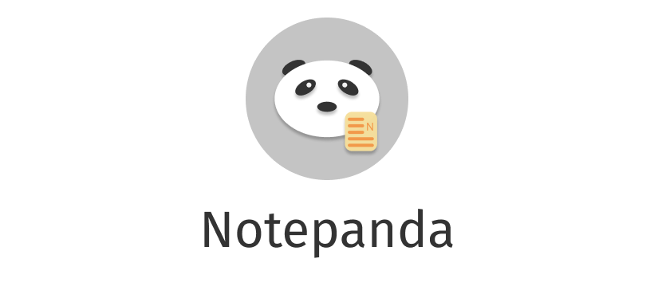

<div align="center"></div>

<h6>Notepanda's icon is owned by [ChungZH](https://github.com/ChungZH), any unanthorized usage will be blamed.</h6>

# Notepanda

[](https://app.codacy.com/manual/ChungZH/notepanda?utm_source=github.com&utm_medium=referral&utm_content=ChungZH/notepanda&utm_campaign=Badge_Grade_Dashboard)
 [](https://app.fossa.io/projects/git%2Bgithub.com%2FChungZH%2Fnotepanda?ref=badge_shield)


> **A simple cross-platform notepad. Based on Qt and C++.**


Just practice XD

🚧 WIP

## Why write this text editor?

I recently started getting started with Qt, this is my first Qt project, the first C++ project, and the first project in my life. I hope to develop my skills through this project.

I'm not going to use this as a replacement for my other text editors because it's too simple and I am too poor :)

So enjoy this toy 🍵️

## Feature

- Basic operation
- Line numbers
- Syntax highlight
- Launch from the shell by typing: `notepanda` or `notepanda CMakeLists.txt`.

## Dependencies

- CMake >= 3.1.0
- Qt >= 5.14 (not sure)
- KSyntaxHighlighting
    - Extra CMake Modules

## Roadmap

See [Projects](https://github.com/ChungZH/notepanda/projects/).

## Install

Go to [Releases](https://github.com/ChungZH/notepanda/releases) page.

If you are Arch Linux (or Arch-based distros) user, you can get Notepanda from AUR.

You may use an AUR helper such as `yay` to automatically handle the build process of AUR packages:

```sh
yay -S notepanda
```

The latest version is `v0.0.1` now.

## Contributions / Bugs


You want to contribute to Notepanda? Awesome! ~~Please read the contribution guidelines for details and useful hints.~~ There is **no rules** now!

If you found a bug or have a feature request, you can report it [GitHub Issue](https://github.com/ChungZH/notepanda/issues).

🙇‍♂️️ Thank you very much!

## Special Thanks

- [Qv2ray](https://github.com/qv2ray/qv2ray)

## Copyright

Copyright (c) ChungZH. All rights reserved.

**Libraries that have been used in Qv2ray are listed below (Sorted by date added):**

- Please see: [assets/CREDIT.md](assets/CREDIT.md)

## LICENSE

⚖ Released under the [MIT license](/LICENSE.Md).

[](https://app.fossa.com/projects/git%2Bgithub.com%2FChungZH%2Fnotepanda?ref=badge_large)

------

🗒️ Notepanda © ChungZH.

> [Blog](https://chungzh.cn) · [Portfolio](https://chungzh.cc) · [GitHub](https://github.com/ChungZH)
