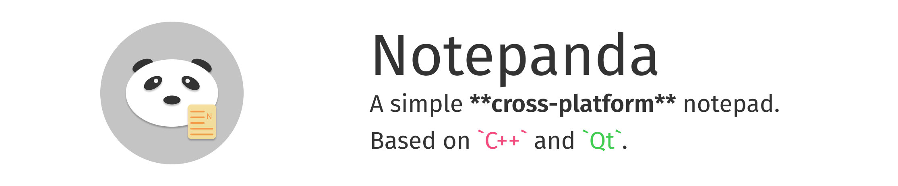
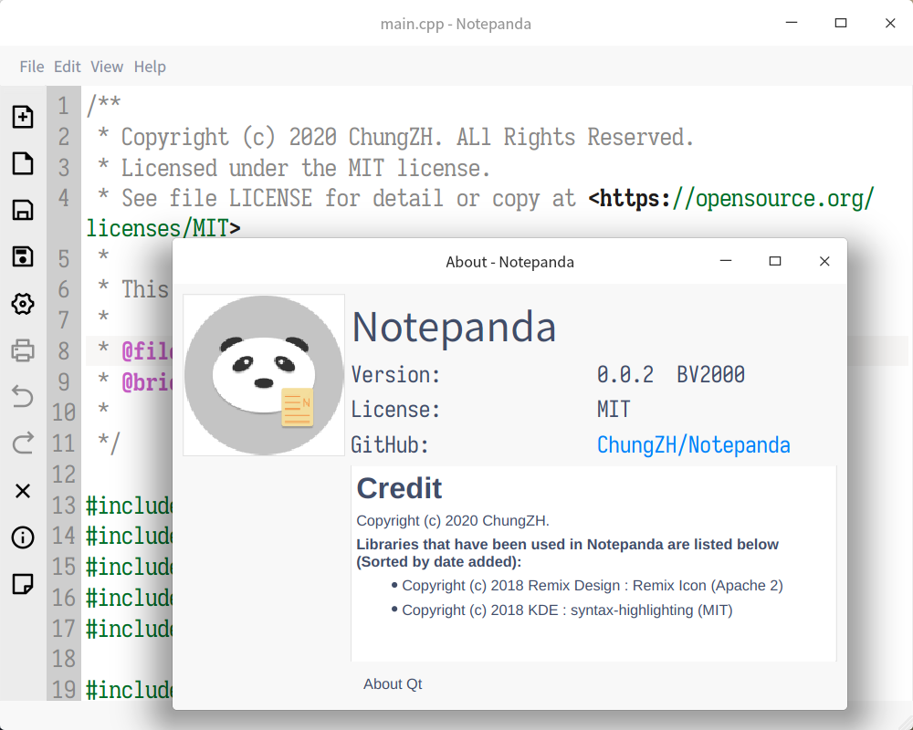

###### Notepanda's icon is owned by ChungZH, any unanthorized usage will be blamed.

# Notepanda

[](https://app.codacy.com/manual/ChungZH/notepanda?utm_source=github.com&utm_medium=referral&utm_content=ChungZH/notepanda&utm_campaign=Badge_Grade_Dashboard)
 [](https://app.fossa.io/projects/git%2Bgithub.com%2FChungZH%2Fnotepanda?ref=badge_shield)


> **A simple cross-platform notepad. Based on Qt and C++.**

If you want to track the latest news of Notepanda, welcome to our [📰 Telegram channel](https://t.me/notepanda)!

BTW you can read this post in my blog: [Notepanda 开发小结](https://chungzh.cn/2020/05/16/notepanda/)

## Why write this text editor?

I recently started getting started with Qt, this is my first Qt project, the first C++ project, and the first project in my life. I hope to develop my skills through this project.

I'm not going to use this as a replacement for my other text editors because it's too simple and I am too poor :)

So enjoy this toy 🍵️

## Screenshots

|                Light                 |                Dark                 |
| :----------------------------------: | :---------------------------------: |
|  |  |
|  |   |

## Feature

- Basic operation
- Line numbers
- Syntax highlight
- Launch from the shell by typing: `notepanda` or `notepanda CMakeLists.txt`
- Preview panel (Support Markdown & HTML)
- Opening files with Drag and Drop.

## Install

If you are Windows / MacOS / Linux user, you can go to [Releases](https://github.com/ChungZH/notepanda/releases) page.

If you are using [Scoop](https://scoop.sh), you can get Notepanda from my sweet scoop bucket [🍑 peach](https://github.com/ChungZH/peach):

```powershell
scoop bucket add peach https://github.com/ChungZH/peach
scoop install notepanda
```

If you are Arch Linux (or Arch-based distros) user, you can get Notepanda from AUR. 

You may use an AUR helper such as `yay` to automatically handle the build process of AUR packages:

```sh
yay -S notepanda
```

The latest version is `v0.1.4` now.

## Build

For more information, go to [How to build - GitHub Wiki](https://github.com/ChungZH/notepanda/wiki/How-to-build---%E5%A6%82%E4%BD%95%E6%9E%84%E5%BB%BA).

### Required Tools

- [CMake](https://cmake.org/) >= 3.1.0
- [Ninja](https://ninja-build.org/)

### Required Dependencies

- [Qt](https://www.qt.io/) >= 5.11 (recommendation 5.14)
- [KSyntaxHighlighting](https://api.kde.org/frameworks/syntax-highlighting/html/index.html)
    - [Extra CMake Modules](https://api.kde.org/ecm/)

## Roadmap

See [Projects](https://github.com/ChungZH/notepanda/projects/).


## Contributions / Bugs


You want to contribute to Notepanda? Awesome! ~~Please read the contribution guidelines for details and useful hints.~~ There is **no rules** now!

If you found a bug or have a feature request, you can report it [GitHub Issue](https://github.com/ChungZH/notepanda/issues).

🙇‍♂️️ Thank you very much!

## Special Thanks

- [Qv2ray](https://github.com/qv2ray/qv2ray)

## Copyright

Copyright (c) ChungZH. All rights reserved.

**Libraries that have been used in Notepanda are listed below (Sorted by date added):**

- Please see: [assets/CREDIT.md](assets/CREDIT.md)

## LICENSE

⚖ Released under the [MIT license](/LICENSE.Md).

[](https://app.fossa.com/projects/git%2Bgithub.com%2FChungZH%2Fnotepanda?ref=badge_large)

------

🗒️ Notepanda © ChungZH.

> [Blog](https://chungzh.cn) · [Portfolio](https://chungzh.cc) · [GitHub](https://github.com/ChungZH)
